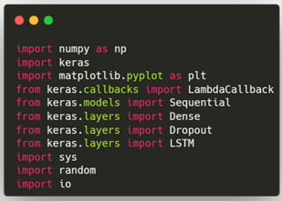

Para realizar esta tarea, primero que todo vamos a obtener las librerías necesarias.

Cargamos la información, como se mencionó anteriormente se hará uso de libro “don quijote”. Para ello traemos la información desde su alojamiento y luego lo leemos y pasamos a una variable denominada text, todo en minúsculas

Luego de esto pasamos el contexto textual evaluando la cantidad de caracteres que contienen obteniendo del “quijote” la siguiente salida.
['\n', ' ', '!', '"', "'", '(', ')', ',', '-', '.', '0', '1', '2', '3', '4', '5', '6', '7', ':', ';', '?', ']', 'a', 'b', 'c', 'd', 'e', 'f', 'g', 'h', 'i', 'j', 'l', 'm', 'n', 'o', 'p', 'q', 'r', 's', 't', 'u', 'v', 'w', 'x', 'y', 'z', '¡', '«', '»', '¿', 'à', 'á', 'é', 'í', 'ï', 'ñ', 'ó', 'ù', 'ú', 'ü'].
Siendo estos valores de forma general los usados para representar el contenido del texto. 
Tambien obtenemos los índices_char y los char_indices, valores que asignan un índice a cada valor estimado, y tambien un carácter a cada valor, con el fin de mantener la relación que luego será usada, como entrada y salida del modelo. 
Char_indices: {'\n': 0, ' ': 1, '!': 2, '"': 3, "'": 4, '(': 5, ')': 6, ',': 7, '-': 8, '.': 9, '0': 10, '1': 11, '2': 12, '3': 13, '4': 14, '5': 15, '6': 16, '7': 17, ':': 18, ';': 19, '?': 20, ']': 21, 'a': 22, 'b': 23, 'c': 24, 'd': 25, 'e': 26, 'f': 27, 'g': 28, 'h': 29, 'i': 30, 'j': 31, 'l': 32, 'm': 33, 'n': 34, 'o': 35, 'p': 36, 'q': 37, 'r': 38, 's': 39, 't': 40, 'u': 41, 'v': 42, 'w': 43, 'x': 44, 'y': 45, 'z': 46, '¡': 47, '«': 48, '»': 49, '¿': 50, 'à': 51, 'á': 52, 'é': 53, 'í': 54, 'ï': 55, 'ñ': 56, 'ó': 57, 'ù': 58, 'ú': 59, 'ü': 60}
Indices_char: {0: '\n', 1: ' ', 2: '!', 3: '"', 4: "'", 5: '(', 6: ')', 7: ',', 8: '-', 9: '.', 10: '0', 11: '1', 12: '2', 13: '3', 14: '4', 15: '5', 16: '6', 17: '7', 18: ':', 19: ';', 20: '?', 21: ']', 22: 'a', 23: 'b', 24: 'c', 25: 'd', 26: 'e', 27: 'f', 28: 'g', 29: 'h', 30: 'i', 31: 'j', 32: 'l', 33: 'm', 34: 'n', 35: 'o', 36: 'p', 37: 'q', 38: 'r', 39: 's', 40: 't', 41: 'u', 42: 'v', 43: 'w', 44: 'x', 45: 'y', 46: 'z', 47: '¡', 48: '«', 49: '»', 50: '¿', 51: 'à', 52: 'á', 53: 'é', 54: 'í', 55: 'ï', 56: 'ñ', 57: 'ó', 58: 'ù', 59: 'ú', 60: 'ü'}
		Esto se realiza con las siguientes líneas de código.

En el siguiente segmento vamos a definir algunas variables que nos permitirán, tomar los ejemplos de los textos, en este caso usaremos una variable llamada SEQ_LENGTH = 35, en donde se tomara 35 caracteres, un step de 3 y se crearan las variables rawX y rawY que almacenaran los resultados

El step, se vincula con el fin de generar un salto en la recolección de la información del texto obteniendo, siendo un avance frente al texto que servirá para recorrer todo el contenido del libro y además obtener una salida, dejando en el rawX un texto con un valor faltante al final, siendo este el valor de rawY. 

En la imagen se aprecia las entradas y las salidas respectivas formadas por el código de la ilustración número 5.
Ahora vamos a seleccionar un número máximo de secuencias para el entrenamiento, debido a que el resultado después de generarlas fue de 690.388 secuencias, para este caso de tomaremos como máximo unas 200.000 secuencias, debido a que un numero superior genera conflictos con la memoria RAM, tanto en una computadora local, como el Google Colab.

Luego de esto, como primer paso, vamos a permutar o barajas los valores de los índices de los valores de rawX, con el fin desordenar los datos, con el fin de mejorar la generalización, esto puede hacer que funcione mejor con datos no vistos evitando así la “memorización”. 
Luego convertiremos los datos rawX y rawY en arrays. Para luego usar el valor de permutación obtenido para reordenar las secuencias rawX y rawY. Y por ultimo solo se tomara el máximo de secuencias que se había definido en la ilustración 8.

transforma secuencias de texto pre-tokenizadas en una representación adecuada para un el modelo. Con este convertimos los equivalentes de los valores de los índices en 1 o 0 en una array o matriz.
Luego generamos el model, para ello tomamos como lo menciono el enunciado un modelo secuencial, para luego generar un LSTM, con 128 unidades que procesan y aprenden información dentro de la capa, acompañamos esta secuencia con un DROPOUT(0.2) y una función de activación tipo softmax.

Luego pasamos a compilar el modelo usando el optimizador Adam, la función de perdida ‘categorical_crossentropy’ y como métrica la exactitud.

Las siguientes funciónes sample toma una distribución de probabilidad dada por probs y devuelve el índice del elemento elegido según esa distribución. El parámetro temperature ajusta la "diversidad" de la elección, valores más altos hacen que las elecciones sean más arriesgadas, eligiendo elementos con baja probabilidad más a menudo, mientras que valores más bajos hacen que las elecciones sean más conservadoras.
La función generate_text toma un texto inicial seed_text y un modelo entrenado, y genera un nuevo texto de longitud length. Utiliza el modelo para predecir el siguiente carácter de manera iterativa, ajustando la secuencia de entrada según los caracteres generados anteriormente. El parámetro temperature controla la diversidad de las predicciones, similar a cómo funciona en la función sample.

Generate Text, retorna las secuencias que se están produciendo producto de la predicción del modelo.
El siguiente código imprime las estadísticas de entrenamiento “loss” y “accuraccy” después de cada época, esta adición se vinculara como callback, desde el entrenamiento del modelo. 

Ahora vamos a entrenar el modelo, para ello usaremos los parámetros X, y con un batch_size de 128 y 40 epocas inicialmente, adicionalmente se adición un callback, para poder visualizar los datos de entrenamiento en tiempo real.

En la imagen se puede visualizar el avance de la generación del texto, Text Send Text: es la secuencia del libro original y Generated Text: Es la salida del modelo.
Vemos como en la primera época con una exactitud del 28% no se encuentra un funcionamiento congruente y lógico. 

Luego de 40 épocas se aprecia un cambio sustancial en cuanto a la predicción del texto.

•	El tiempo de procesamiento de la información juega un papel importante, es importante resaltar que se debe dividir modularmente cualquier ejercicio en cuanto al procesamiento de lenguaje natural con el fin de no perder el avance frente a posibles fallos, tal cual como se realizó en este ejemplo.

•	El modelo presentado en este documento comenzó con un valor de Dropout de 0.5, lo que resultó en una precisión inicial del 10%. En contraste, cuando se inició con un Dropout de 0.2, la precisión inicial fue del 28%. Si bien existe una posible relación entre estos valores, se requieren más pruebas para validar definitivamente esta afirmación.

•	El proceso de entrenamiento de este modelo resulto en un tiempo de 3 horas, lo que conlleva a la necesidad de buscar herramientas con mayor capacidad de cómputo, con el fin de realizar las pruebas necesarias en donde se anexen conclusiones específicas.

•	La exactitud, toma valores de crecimiento en cada iteración, lo que nos permite asimilar que está volviéndose mejor en cada ciclo, lastimosamente en esta investigación no se cuenta con una máquina virtual o física, lo suficientemente optima que permita llegar hasta ese nivel de exactitud en el tiempo que requiere la investigación. 

•	Esta práctica puede ser usada en aplicaciones de autocompletado de código en los distintos lenguajes de programación, es por ello que GitHub, saco su producto GitHub copilot, debido a que cuenta con la suficiente información dentro de sus repositorios. Aunque se debe de ser cuidados con la información que se usa en el entrenamiento de estos modelos ya que pueden tener en su entrenamiento datos privados como claves de acceso entre otras. Demanda a GITHUB COPILOT. https://www.xataka.com/legislacion-y-derechos/copilot-copia-codigo-piedad-ahora-microsoft-se-enfrena-a-demanda-colectiva-que-podria-poner-jaque-a-herramienta 

